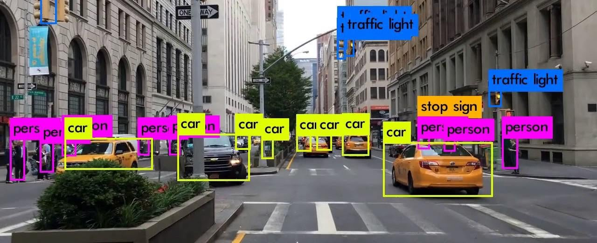

# YOLO
You Only Look Once

- Apply a single `Neural Network` to the full image.
- Network divides the image into regions and predicts `bounding boxes` and probabilities for each `region`
- Bounding boxes are weighted by the predicted probabilities.

